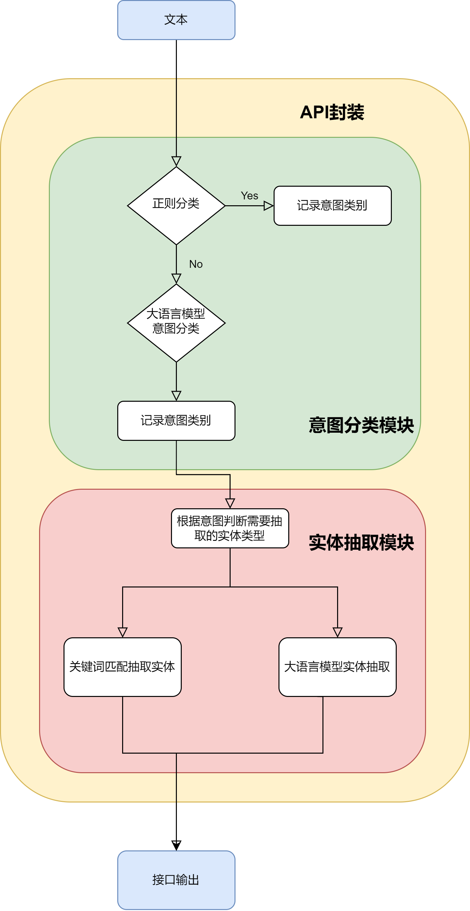

# 对话系统功能组件——意图分类+实体抽取

## 工具的组织架构图



用户的文本进来，
首先进行意图分类
首先通过正则匹配，得到意图分类结果，正则匹配失败的，分类到其他意图
其他意图的文本，会通过大语言模型的提示词工程来实现下一轮的意图分类
接下里来进行实体抽取
配置文件中规定了哪些类别的意图抽取哪些类别的实体，类别和实体的关系，可以是一对一，也可以一对多
对于某些类别的实体，通过关键词匹配，得到目标实体，
对于某些类别的实体，通过大语言模型的提示词工程来实体抽取


## 工具介绍
用户只需要提供少量的分类样例数据
```txt
请帮我查询阿里巴巴集团有限公司的招投标信息并包含企业名称。————招投标信息查询
我需要了解阿里巴巴集团有限公司这个招标项目的企业法人马云。————查询企业法人信息
查询关于下个月的路演活动，并告诉我有哪些企业如腾讯科技（深圳）有限公司参加。————路演活动查询
查看腾讯科技（深圳）有限公司参展的详细信息。————查询企业参展信息
请告知企业法人马化腾相关的路演活动详情。————路演活动详情
查询宁德时代新能源科技股份有限公司参展概述并提供企业名称。————企业参展概述
能否帮我查看一下最新的招标公告，尤其是包含百度在线网络技术（北京）有限公司企业名称的部分。————查看招标公告
```

通过修改配置文件、写正则、改大模型提示词
就可以实现对任意文本，进行自定义的分类和实体抽取工作


**工具依赖**
底层驱动大模型为vllm框架启动的 qwen1.5-32b-int4 大语言模型


## 工具配置流程

1. 修改配置文件

2. 运行代码，修改流程代码
```python
python rebuild.py
```

3. 修改mapper.py中的编码

4. 增加意图正则和实体正则

5. 修改意图大模型提示词和实体大模型提示词

6. 修改测试样例./test/query.txt

7. 运行测试代码, 验证工具效果

```python
python api.py
cd test
python test_api_batch.py
```

## 工具支持的API服务部署流程

构建镜像
```bash
docker build -t qa_intent:v1.0 .
```

启动容器
```bash
# 测试
docker run -it --rm --name=qa_intent -p 11400:8000 qa_intent:v1.0 /bin/bash
python api.py
```

```bash
# 上线
docker run -dit --name=qa_intent -p 11400:8000 qa_intent:v1.0 python api.py
```

## 服务调用样例

```python
import requests

# 设置API的URL
url = 'http://localhost:8000/process_request/'
# url = 'http://0.0.0.0:8000/process_request/'

# 定义请求数据
data = {
        "content": "给客户推荐路演活动的策划方案，时间是中秋节或者重阳节，公司叫做华为科技有限公司"
}

# 发送POST请求
response = requests.post(url, json=data)

# 打印响应
print("状态码:", response.status_code)
print("响应体:", response.json())
```

返回样例
```bash
{"errorcode": "1", "result": "1", "data": {"content": "给客户推荐路演活动的策划方案，时间是中秋节或者重阳节，公司叫做华为科技有限公司", "intent": 1, "type": 1, "text": [{"企业名称": "华为科技有限公司"}, {"节日名称": "中秋节, 重阳节"}]}, "msg": "success"}
```